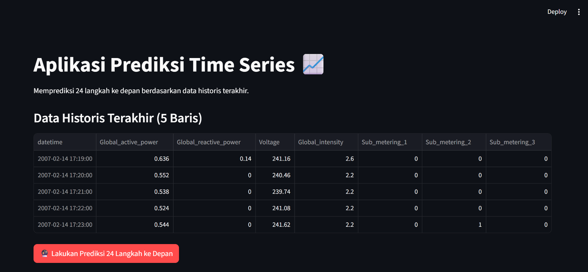
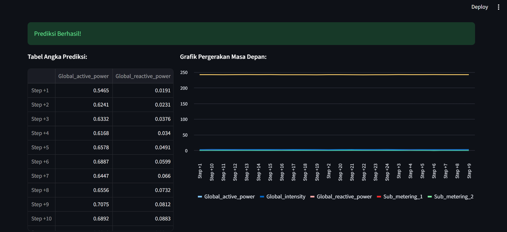

# 📊 Household Electric Power Forecasting

Project ini dibuat untuk pembelajaran *Time Series Forecasting* menggunakan **Deep Learning** dengan framework **TensorFlow**.

Project bertujuan untuk melakukan **prediksi konsumsi listrik rumah tangga** berdasarkan data historis menggunakan pendekatan *time series forecasting* berbasis **MLP (Multi-Layer Perceptron / Dense Neural Network)**.

---

## 📌 Features

- Time Series Forecasting
- Data Preprocessing & Normalization
- Sliding Window Dataset
- Deep Learning dengan TensorFlow
- Forecasting Multi-step (24 timestep)
- Interface prediksi menggunakan Streamlit

---

# 📁 Struktur Folder

```bash
multivariate/
│
├── implementasi-interface/
│   ├── household-electric.py
│   │
│   └── hasil-interface/
│       ├── dashboard.png
│       ├── forecasting-result.png
│       └── chart.png
│
├── house-electric-power.ipynb
├── household-electric-power.py
├── model.h5
└── README.md
```

---

# 📂 Dataset

Dataset berisi data historis konsumsi listrik rumah tangga untuk proses forecasting.

Dataset diambil dari Google Drive:

🔗 https://drive.google.com/uc?id=1AZRfFoyekqSYpri5183RmJjciRGz_ood

---

# ⚙️ Tahapan Project

## 1. Load Data

Dataset dibaca menggunakan **Pandas** dan index diubah menjadi format waktu (`datetime`).

---

## 2. Data Preprocessing

Data dinormalisasi menggunakan metode **Min-Max Scaling**:

```math
x' = \frac{x - x_{min}}{x_{max} - x_{min}}
```

### Tujuan Normalisasi

- Menyamakan skala data
- Mempercepat proses training
- Membantu model lebih stabil saat training

---

## 3. Split Dataset

Dataset dibagi menjadi:

- **50% Training**
- **50% Validation**

---

## 4. Windowing Dataset

Menggunakan teknik **Sliding Window**:

```python
N_PAST = 24
N_FUTURE = 24
SHIFT = 1
```

### Keterangan

- `N_PAST` → jumlah data historis sebagai input
- `N_FUTURE` → jumlah data yang diprediksi
- `SHIFT` → pergeseran window

### Output

- `X` → 24 timestep sebelumnya
- `Y` → 24 timestep berikutnya

---

# 🧠 Arsitektur Model

Model menggunakan pendekatan **Multi-Layer Perceptron (MLP)**.

```text
Input (24 x N_FEATURES)
        ↓
     Flatten
        ↓
 Dense (64, ReLU)
        ↓
 Dense (32, ReLU)
        ↓
Dense (24 x N_FEATURES)
        ↓
 Reshape (24, N_FEATURES)
```

---

# 🚀 Training Model

## Konfigurasi Training

- Optimizer: `Adam`
- Learning Rate: `1e-3`
- Loss Function: `Mean Absolute Error (MAE)`
- Metrics: `MAE`
- Epoch: `100`

---

# ⏹️ Early Stopping Custom

Training akan otomatis berhenti jika:

```python
MAE < 0.055
Validation MAE < 0.055
```

---

# 📈 Hasil Prediksi

Model menghasilkan output berbentuk:

```python
(batch_size, 24, N_FEATURES)
```

Contoh penggunaan:

```python
train_pred = model.predict(train_set)
print(train_pred[0][0])
```

---

# 🌐 Menjalankan Interface Streamlit

Interface Streamlit berada di folder:

```bash
implementasi-interface/
```

## Jalankan Streamlit

Masuk ke folder interface:

```bash
cd implementasi-interface
```

Lalu jalankan:

```bash
streamlit run household-electric.py
```

---

# 📷 Hasil Implementasi Streamlit

## Dashboard Utama




---

# 📷 Fitur Interface

Interface Streamlit menyediakan fitur:

- Input data forecasting
- Menampilkan hasil prediksi
- Visualisasi grafik forecasting
- Load model TensorFlow (`model.h5`)
- Dashboard visual berbasis Streamlit

---

# 📦 Dependencies

- Python 3.x
- pandas
- numpy
- tensorflow
- matplotlib
- streamlit

---

# 💡 Catatan

- Model menggunakan **Dense Layer (MLP)**, bukan LSTM atau GRU.
- Input data di-*flatten* sebelum masuk ke Dense layer.
- Cocok digunakan sebagai baseline model untuk pembelajaran *time series forecasting*.
- Notebook `house-electric-power.ipynb` digunakan untuk eksperimen dan training model.
- File `model.h5` merupakan model hasil training yang digunakan oleh interface Streamlit.

---

# 👨‍💻 Author

**Romualdus Hary Prabowo**

[](https://www.instagram.com/hyporom._)

[](https://www.linkedin.com/in/hypo/)