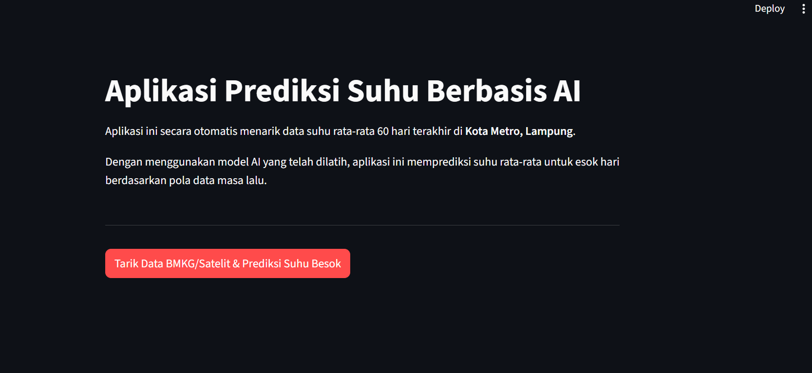
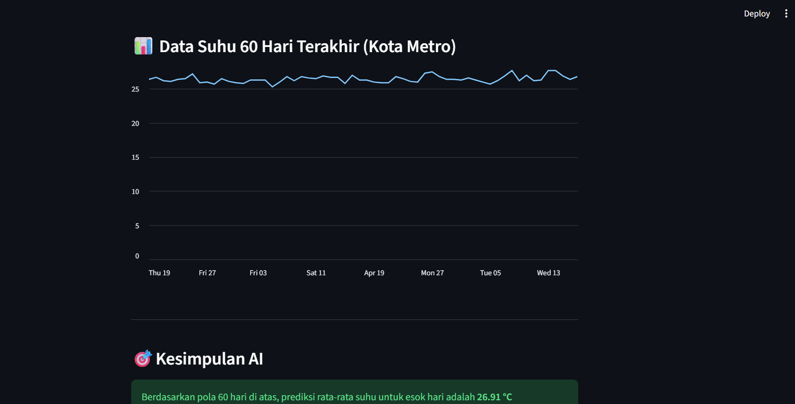

# 🌡️ Weather Temperature Forecasting using Deep Learning (LSTM)


## 📌 Deskripsi Proyek

Proyek ini merupakan sistem prediksi suhu harian menggunakan pendekatan **Deep Learning (LSTM - Long Short-Term Memory)** berbasis data *time series*.

Model memanfaatkan **60 hari data historis** untuk memprediksi suhu pada hari berikutnya, serta terintegrasi dengan **Open-Meteo API** untuk mengambil data cuaca secara *real-time* berdasarkan koordinat geografis.

Aplikasi disajikan dalam bentuk **dashboard interaktif menggunakan Streamlit** untuk memudahkan eksplorasi data dan hasil prediksi.

---

## 🚀 Fitur Utama

* 🌍 **Real-time Data Fetching**
  Mengambil data suhu historis otomatis dari API berdasarkan lokasi

* 🧠 **Deep Learning Forecasting**
  Menggunakan model LSTM untuk menangkap pola temporal pada data

* 📊 **Interactive Dashboard**
  Visualisasi data dan hasil prediksi secara interaktif dengan Streamlit

* 📈 **Temperature Prediction Visualization**
  Menampilkan grafik perbandingan suhu aktual dan hasil prediksi

---

## 🧠 Arsitektur Model

* **Input Shape**: `(batch, window_size, features)`

* **LSTM Layer**:

  * 2 stacked LSTM layers (60 units)

* **Dense Layer**:

  * Fully connected layer dengan aktivasi ReLU

* **Loss Function**:

  * Huber Loss

* **Optimizer**:

  * SGD + Momentum

---

## 📈 Konsep Utama: Sliding Window

* Ambil **60 hari data sebelumnya** → sebagai **input (X)**
* Prediksi **hari berikutnya** → sebagai **target (Y)**

### Contoh

* `[Hari 1 - 60]` → Prediksi Hari 61
* `[Hari 2 - 61]` → Prediksi Hari 62

---

## 🖼️ Tampilan Aplikasi Streamlit

### Dashboard Streamlit

----

## 📷 Preview Dashboard

### Main Dashboard




---

## 🖥️ Cara Menjalankan

### 1. Clone Repository

```bash
git clone https://github.com/RomualdusHaryPrabowo/fundamental-deep-learning.git
cd fundamental-deep-learning/time-series/univariate
```

### 2. Install Dependencies

```bash
pip install -r requirements.txt
```

### 3. Jalankan Aplikasi

```bash
cd implementasi-interface
streamlit run climate-app.py
```

---

## 📂 Struktur Folder

```bash
time-series/
├── univariate/
│   ├── implementasi-interface/
│   │   ├── images/
│   │   │  
│   │   │   
│   │   │   
│   │   │
│   │   └── climate-app.py
│   │
│   ├── daily-climate.ipynb
│   ├── daily-climate.py
│   ├── model.h5
│   └── processing_data.py
│
└── README.md
```

---

## 🛠️ Technologies Used

* Python
* TensorFlow / Keras
* NumPy
* Pandas
* Matplotlib
* Streamlit
* Open-Meteo API

---

## 👨‍💻 Author

**Romualdus Hary Prabowo**

[](https://www.instagram.com/hyporom._)

[](https://www.linkedin.com/in/hypo/)

[](mailto:romualdushypo@gmail.com)
